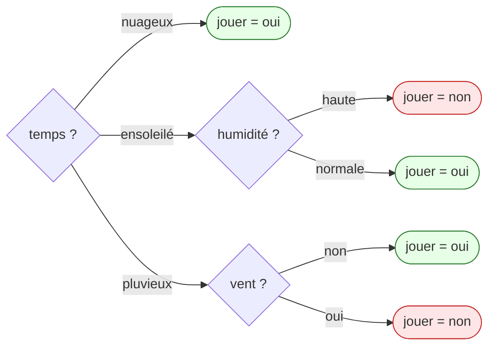

```mermaid
flowchart LR
    A{temps ?}
    A -->|nuageux| B([jouer = oui])
    A -->|ensoleilé| C{humidité ?}
    C -->|haute| D([jouer = non])
    C -->|normale| E([jouer = oui])
    A -->|pluvieux| F{vent ?}
    F -->|non| G([jouer = oui])
    F -->|oui| H([jouer = non])

    %% Styles (optionnels)
    classDef yes fill:#e6ffe6,stroke:#2e7d32,stroke-width:1px;
    classDef no  fill:#ffe6e6,stroke:#c62828,stroke-width:1px;
    class B,E,G yes;
    class D,H no;
```
