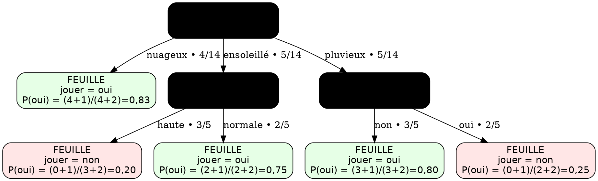

## Version ASCII de notre arbre de décision

```txt
                             [ temps ? ]
                 H = 0.940 • IG = 0.247 • P(oui) = 9/14 (0.643)
                /                 |                   \
               /                  |                    \
     nuageux 4/14          ensoleillé 5/14            pluvieux 5/14
          |                       |                        |
    [ FEUILLE ]              [ humidité ? ]             [ vent ? ]
    jouer = oui          H = 0.971 • IG = 0.971     H = 0.971 • IG = 0.971
    P(oui) = 4/4 = 1.00  P(oui) = 2/5 (0.40)        P(oui) = 3/5 (0.60)
                               /     \
                        haute 3/5    normale 2/5
                          |              |
                    [ FEUILLE ]      [ FEUILLE ]
                    jouer = non      jouer = oui
                    P(oui) = 0/3     P(oui) = 2/2
                    = 0.00           = 1.00

                                                  /          \
                                            non 3/5          oui 2/5
                                              |                |
                                        [ FEUILLE ]       [ FEUILLE ]
                                        jouer = oui       jouer = non
                                        P(oui) = 3/3      P(oui) = 0/2
                                        = 1.00            = 0.00
```

## Comment lire / obtenir ces probabilités (compatibles GitHub)

* **Sur les arêtes** : proportion d’exemples qui suivent le chemin.
  Exemple racine → *ensoleillé* : \$5/14\$.

* **Dans un nœud** :

  $$
  P(\text{oui})=\frac{n_{\text{oui}}}{n_{\text{total}}}
  $$

  Exemple nœud *ensoleillé* : \$2/5=0.40\$.

* **Dans une feuille (probabilité prédite)** : même formule.
  Exemple *pluvieux & vent = non* : \$3/3=1.00\$.

* **Entropie** :

  $$
  H=-\sum_{c\in\{\text{oui},\text{non}\}} p_c\log_2 p_c
  $$

* **Gain d’information** :

  $$
  IG=H(\text{parent})-\sum_i \frac{n_i}{n_{\text{total}}}\,H(\text{enfant}_i)
  $$

* **Astuce (lissage de Laplace)** pour éviter 0 %/100 % sur de très petites feuilles :

  $$
  \hat P(\text{oui})=\frac{n_{\text{oui}}+1}{n_{\text{total}}+2}
  $$

  Exemple : \$n\_{\text{oui}}=0\$, \$n\_{\text{total}}=3\$ → \$\hat P=\tfrac{0+1}{3+2}=0.20\$.

## Version Graphviz (DOT) — avec lissage de Laplace dans les feuilles

> Colle ce bloc sur **Graphviz Online** (dreampuf.github.io/GraphvizOnline) et exporte en SVG/PNG.




👉 Vous pouvez le coller dans [Graphviz Online](https://dreampuf.github.io/GraphvizOnline) et exporter en **SVG/PNG**.


